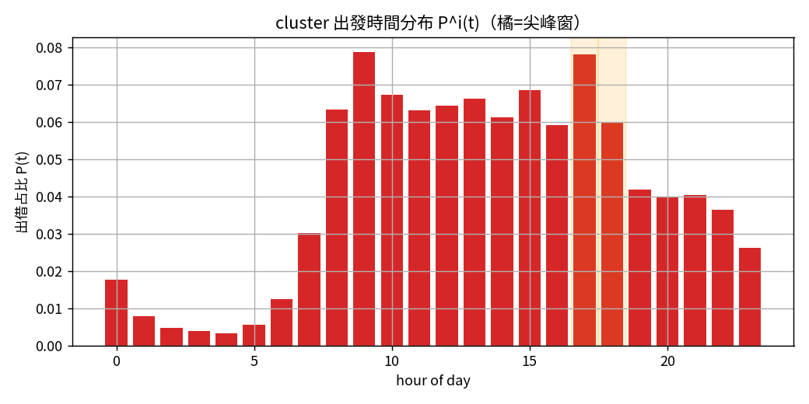
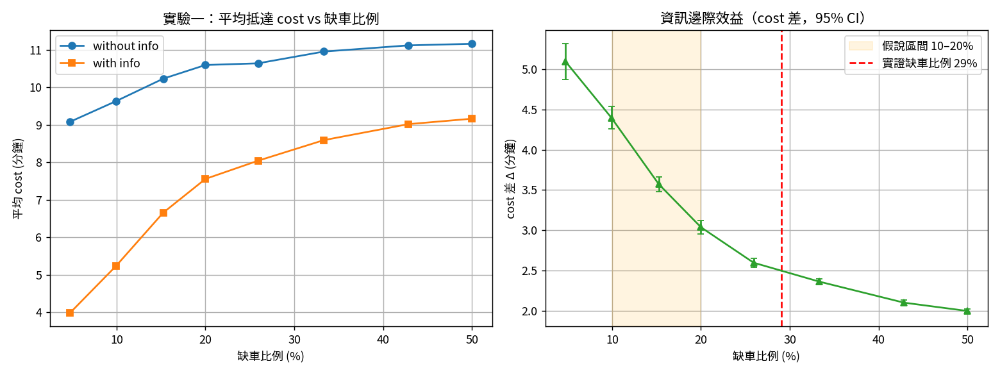
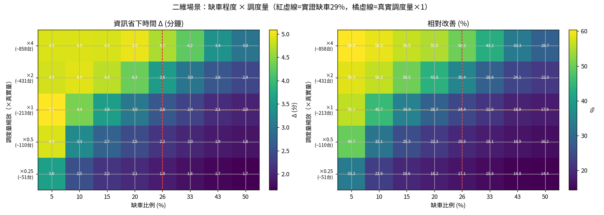
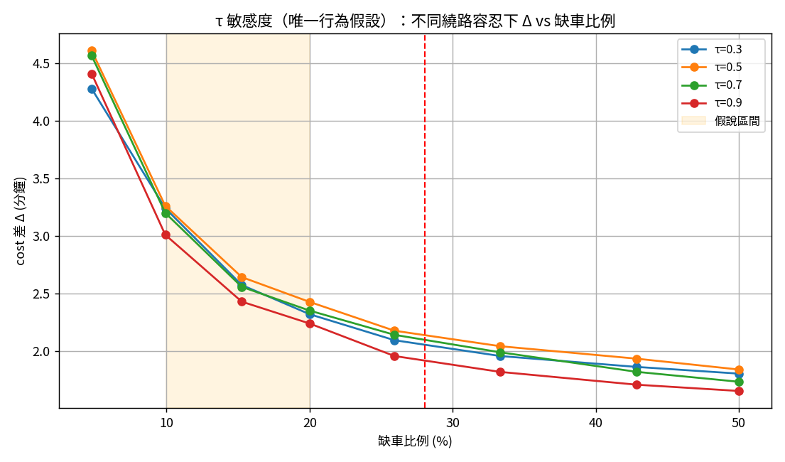
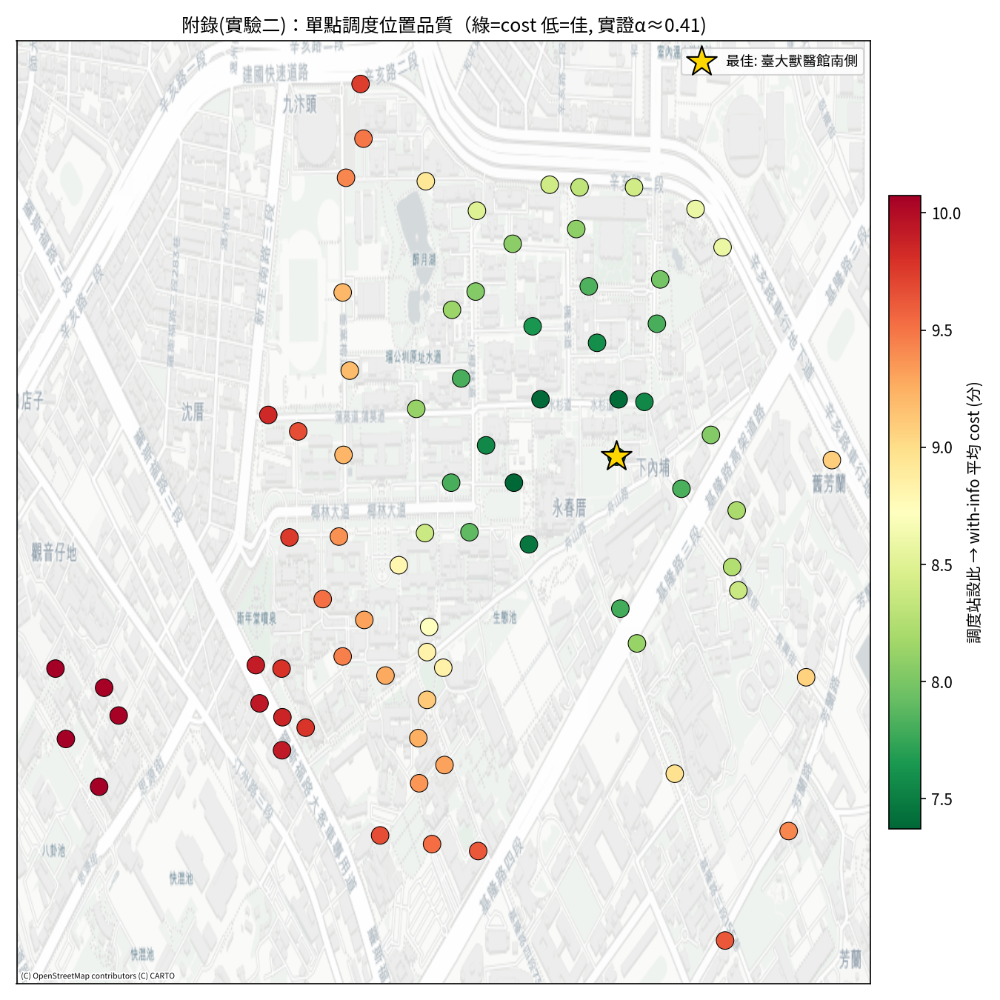
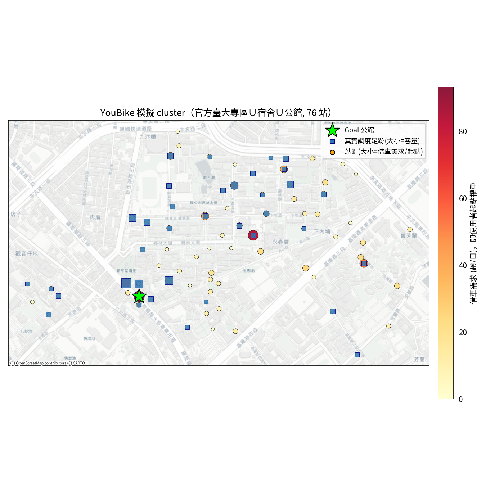

# 共享單車調度資訊對使用者等待成本之模擬 — 期末報告

**計算機網路實驗 期末專題 ｜ 第四組（CN-Team4）**

程式碼與可重現流程：<https://github.com/CN-Team4/final>　｜　規格：[`docs/final.md`](docs/final.md)

---

## 摘要

YouBike 在校園尖峰時段常發生「附近借不到車」的情況，營運方雖派調度車補給，但**調度車的即時位置
只有營運方掌握，一般使用者並不知道**。本研究以臺灣大學校園（76 個 YouBike 站）為場景，建立
time-step 模擬，比較使用者在「**取得調度資訊**」與「**未取得調度資訊**」兩種情境下抵達目的地的
平均總時間，藉以量化「**把現有調度車位置公開化**」的邊際效益。

兩情境使用**完全相同的調度供給**（調度站分布由真實動態資料還原，總量錨在物理中估），
**唯一差異是使用者是否得知**，故主指標（兩組平均 cost 差）即資訊本身的價值。實驗顯示：在臺大實證
缺車比例（約 32%）下、於物理合理的調度量範圍（約 50–200 台/尖峰窗，即 2 台調度車 × 25 加上現場
解壓縮與多趟）內，公開調度資訊使平均抵達時間下降約 **1.8–2.4 分鐘（15–22%，中估約 2.0 分/18%）**；
在缺車 10–20% 區間則下降 **2.4–3.2 分鐘（22–31%）**。結論對本研究唯一的行為假設（繞路容忍 τ）
穩健，且資訊效益隨缺車程度遞減、隨調度量遞增。調度量本身難以精確量測，為最大不確定來源，
我們將其當不確定參數掃描，結論方向在整個合理區間皆成立。我們另發現現有調度主力集中於校園邊緣的
公館站，而殘餘未滿足需求集中在校園東側的男一舍與明達館一帶，將調度資源配置於該區的邊際效益最高。

---

## 1. 緒論

### 1.1 問題與動機
共享單車的供需在時空上高度不均，尖峰時段熱點站點常缺車。營運方以調度車（補給卡車）動態補車，
但補給的時間與地點是營運內部資訊。對使用者而言，當地借不到車時只能憑經驗碰運氣。**若把調度車
的即時位置透過 app 公開給使用者，能否縮短他們的等待與移動成本？** 這是本研究的核心問題，亦是
一個典型的「資訊揭露對系統效率之影響」的網路服務設計議題。

### 1.2 兩個比較情境（全文「兩情境」即指此二者）
兩情境的**調度供給（位置、容量、數量）完全相同**，唯一差別是**使用者是否知道調度車的位置**：

| 情境 | 別稱 | 缺車者的行為 |
|---|---|---|
| **A：未取得調度資訊** | without info / 無資訊 | 不知道調度車在哪 → 理性前往**離自己最近的一站**碰運氣；該站恰為調度站且有餘量才借到、騎去目的地，否則走路到目的地。 |
| **B：取得調度資訊** | with info / 有資訊 | 知道所有調度站位置 → 走到**容忍距離（τ × 到目的地距離）內、有餘量的最近調度站**借車騎走；若無可達調度站則走路到目的地。 |

> 主指標＝兩情境「平均抵達目的地總時間」之差，即「公開調度車位置」此一**資訊**的價值。
> 兩情境的決策流程詳見 §4.3；下文「無資訊／有資訊」即分別指情境 A／B。

### 1.3 研究設計的關鍵
- **唯一操弄變量是資訊**：兩情境的調度站位置、容量、數量完全相同，差別僅在使用者知不知道。
  因此資料中既有的調度效果、供給偏差等屬共模誤差，在兩組 cost 差中對稱相消。
- **不新增任何供給**：研究的是「現有調度位置資訊公開化」的邊際效益，而非增加調度車。
- **盡可能以真實資料取代假設**：調度站位置與容量、缺車程度、出發時間分布、目的地滿位率，
  全部由真實營運資料實證取得；唯一的行為假設只剩「繞路容忍度 τ」，並對其做敏感度分析。

### 1.4 貢獻
1. 以兩份公開資料（44 GB 即時動態 + 起訖統計）建立**資料驅動**的校園 YouBike 缺車模擬。
2. 量化「調度資訊公開化」的時間效益，並以二維場景（缺車程度 × 調度量）刻畫其適用範圍。
3. 提出可重現的開源實作（GitHub），含互動地圖與 agent 移動動畫。

---

## 2. 資料

| 來源 | 內容 | 用途 |
|---|---|---|
| YouBike 2.0 即時場站動態（原始 2025-08~09，9.1 GB／43.9 GB CSV；**本研究取值自 2025-09-01 起、僅平日**，與平日 OD、開學期間對齊） | 各站每次輪詢的可借車數 sbi、空位 bemp、時間、座標 | 出發時間分布 $P^i(t)$、真實調度足跡、缺車率、滿位率 |
| 臺北市 YouBike 起訖站點統計（data.taipei，GEOJSON，平日 202512） | 站對站月交易量 $D_m^{ij}$、站點座標 | 月 OD 需求、站點圖 |

動態資料 18 欄無表頭（sno, sna, tot, **sbi**, sarea, **mday**, lat, lng, …, **bemp**, act, …）。以 polars 在
144 核機器上串流處理，約 60–70 秒可完成一次全量彙整。兩資料源皆由 `fetch_data.sh` 自動取得。

---

## 3. 系統模型與假設

### 3.1 站點圖與 Cluster（官方分類，76 站）
我們不使用任意半徑，而採 YouBike 官方分類定義臺大活動範圍：

> **cluster ＝** `district = 臺大專區`（官方校園專區） **∪** 站名含「臺大／台大」（含大安區的宿舍帶，
> 如男七舍、永齡、土木研究） **∪** 公館各出口（Goal） **−** 市區臺大醫院 3 站（離校園 ~3 km）
> **＝ 76 站**

此定義涵蓋校園核心、周邊宿舍帶與公館商圈，且不依賴人為距離門檻。站點間採完全圖、Manhattan
距離；騎車速度為步行 5 倍（$V_{walk}=1.25$、$V_{bike}=6.25$ m/s）。

### 3.2 調度資源（分布用資料，總量為不確定參數）
**位置與分布**由資料還原：偵測各站「可借車數單步躍增 ≥ 10」之事件視為卡車補貨，得 cluster 內
**37 站**被補車（公館 3 號出口最多，其餘分散於大一女舍、農業陳列館、椰林小舖等），各站相對比例由
資料決定。**總量**則難以精確量測——偵測值（約 213 台／尖峰窗）可能含自然還車潮誤判而偏高，而校內
調度量本身約為 2 台調度車 × 25，加上現場**解壓縮**（卸於站旁暫存、待缺車時再上架）與可能多趟，
故為吞吐量而非靜態載量。我們因此**將總量錨在物理中估 $K_{total}=100$ 台/尖峰窗**（各站按資料比例
分配），並以整體縮放 $s$ 掃描 25/50/100/200/400 台/窗，其中 **50–200 為物理合理區間**，
把調度量當作不確定參數處理。
兩情境使用完全相同的此足跡與容量。

### 3.3 母體與假設
- 模擬母體為**缺車組**（規模 $\alpha D_t$），其空間分布依各站**實測尖峰缺車率**加權（集中於校園
  深處真實高缺車站）。
- 使用者為理性最短路徑決策者，**不採等待行為**（見 §5.3 理由）。
- 不考慮汽機車、共乘、反方向找車。

---

## 4. 方法論

### 4.1 需求估計（§6）
$$D_d^{ij}=D_m^{ij}/N_d,\quad D_t^{ij}=D_d^{ij}\,P^i(t),\quad \text{缺車組}=\alpha D_t^{ij}\cdot w_i$$
其中 $N_d=23$（2025-12 工作日），$P^i(t)$ 為出發時間分布，$w_i$ 為各站實測缺車率正規化權重
（使 $\sum$ 缺車量仍 $=\alpha\sum D_t$）。

### 4.2 由動態資料實證推導
- **$P^i(t)$**：同站相鄰兩次狀態變更間 sbi 的下降量視為出借，依小時彙整後正規化為全日占比。
  校園呈早（09h）、午（13h）、晚（17h）多峰，尖峰窗 17–18h 約占全日 12%（圖 1）。
- **缺車率**：各站尖峰 $sbi=0$ 的時間占比；需求加權後 $f\approx32\%$，對應 $\alpha\approx0.48$。
- **滿位率**：各站尖峰 $bemp\le2$ 的占比（公館各出口 80–90%），供還車成本使用。

### 4.3 使用者決策與成本（§7，皆不等待）
- **無資訊**：前往最近的一站 $m$。$m$ 恰為調度站且有餘量 → 走到 $m$ 騎車去 dst；否則走到 $m$
  再走去 dst（命中與否由地理決定）。
- **有資訊**：選容忍距離 $\tau\cdot dist(cur,dst)$ 內、有餘量的最近調度站 $g$ → 走到 $g$ 騎車去 dst；
  無可達則走去 dst。
- **成本（秒，含還車側）**：走路全程 $=dist/V_{walk}$；騎乘 $=dist(i,x)/V_{walk}+dist(x,j)/V_{bike}+ret_j$，
  其中 $ret_j=\text{frac\_full}_j\cdot(dist(j,nv)/V_{bike}+dist(nv,j)/V_{walk})$ 為到 dst 後可能滿位需繞行
  還車的期望成本。

### 4.4 模擬流程
time-step 模擬：依抵達時間先到先服務配置各站調度容量。每組（情境×參數）做 30 次蒙地卡羅
（Poisson 抽缺車數），報平均與 95% 信賴區間。兩情境共用同一批 agent 與同一組調度容量。

### 4.5 實驗設計（§9）
- **實驗一**：固定真實足跡（$s=1,\tau=0.5$），掃缺車比例 $\alpha$。
- **二維熱圖**：掃 $\alpha\times s$（缺車程度 × 調度量縮放）。
- **τ 敏感度**：掃 $\tau\times\alpha$，檢驗唯一行為假設的穩健性。
- **附錄（最佳位置）**：把總容量集中單一站，掃全 cluster 找 cost 低點。

---

## 5. 結果

### 5.1 出發時間分布 $P^i(t)$

*圖 1：cluster 出發時間分布。校園型態，早午晚多峰，橘色為尖峰窗。*

### 5.2 實驗一：資訊效益 vs 缺車比例

*圖 2：左－兩情境平均 cost；右－cost 差 Δ（95% CI），橘色為假說區間、紅虛線為實證缺車比例。
（調度量為中估 100 台/尖峰窗。）*

| 缺車比例 | 無資訊 | 有資訊 | Δ（省下） | 相對改善 |
|---:|---:|---:|---:|---:|
| 4.8% | 9.8 min | 5.4 min | **4.4 min** | 45% |
| 9.9% | 10.4 | 7.2 | **3.2** | 31% |
| 15.3% | 10.8 | 8.1 | **2.7** | 25% |
| 20.0% | 11.0 | 8.6 | **2.4** | 22% |
| 25.9% | 11.1 | 8.9 | 2.2 | 20% |
| 33.3% | 11.3 | 9.3 | 2.0 | 18% |
| 50.0% | 11.5 | 9.7 | 1.8 | 16% |

- 無資訊約 10–11 min 持平（亂找，與缺車程度無關）；有資訊隨缺車上升而升（調度容量飽和）。
- **假說成立**：缺車 10–20% 時資訊顯著省 2.4–3.2 分（22–31%）。臺大實證缺車約 32%，仍省約 2.0 分（18%）。
- 跨物理合理調度量（50–200 台/窗）：實證缺車下 Δ 約 1.8–2.4 分（15–22%），方向一致（見 §5.4）。
- 借車成功率（實證操作點）：**無資訊約 5%、有資訊約 15%**（資訊使成功借車率約 3 倍）。

### 5.3 為何「無等待」：隔離純資訊價值
原始決策流程中，無資訊者可能「在原地等待」，有資訊者則直接行動。若保留此設定，兩情境的 cost 差
會混入「資訊讓人不必枯等」的效果（約佔差值一半），與「知道調度站位置」的價值糾纏。為使主指標
純粹反映**位置資訊**的價值（亦即 §8 共模相消的精神），本研究移除等待分支，使兩情境除資訊外行為
完全一致。

### 5.4 二維場景：缺車程度 × 調度量

*圖 3：左－Δ（分鐘）、右－相對改善（%）。紅虛線＝實證缺車、橘虛線＝中估調度量 100 台/窗、
白框＝物理合理區間 50–200 台/窗。*

- 資訊效益在「**缺車程度低 + 調度量充足**」時最大（左上，改善達近 60%）。
- 物理合理區間內（50–200 台/窗）、實證缺車下，改善約 **15–22%**（Δ 約 1.8–2.4 分）。
- **調度量是放大器**：實證缺車下調度量由約 50 增到約 400 台/窗，改善由約 15% 升到約 29%。
- 調度量為最大不確定來源，但結論方向（資訊顯著有效、隨調度量遞增）在整個區間皆成立。

### 5.5 τ 敏感度（唯一行為假設）

*圖 4：τ 由 0.3 掃到 0.9，Δ–缺車比例曲線。*

四條曲線差異很小（各缺車比例下相差 < 0.5 分鐘，且無一致方向，屬配置重分配的微擾）。
→ 因真實調度足跡夠密，「容忍距離」很少成為限制；**結論不依賴 τ 的特定取值**。

### 5.6 最佳調度位置（附錄／實驗二）

*圖 5：把總容量集中於各候選單站時的 with-info 平均 cost（綠＝低＝佳）。*

最佳單一調度位置在**校園東側的男一舍與明達館一帶**（缺車最嚴重的區域），現有營運主力公館站位於邊緣。
解讀：現有調度已把公館顧好，**殘餘未滿足需求集中於校園深處**（電機二館 62%、森林館 57% 缺車），
故把（額外）調度資源放校園東側的男一舍與明達館一帶邊際效益最高。

### 5.7 空間視覺化與動畫

*圖 6：站點地圖。圓點大小／顏色＝尖峰需求，藍方塊＝真實調度足跡（大小＝容量），綠星＝Goal 公館。*

我們另提供 [`results/anim.html`](results/anim.html)：左右並排兩張 Leaflet 地圖（左無資訊、右有資訊），
同一批 agent、同一時鐘，動畫呈現走路（灰）與騎車（綠）的移動——右圖明顯更多 agent 騎車抵達。

---

## 6. 討論

- **資訊為何有效**：缺車者最大的成本是「找不到車而走長路」。資訊把「賭最近一站」變成「導向到
  容忍範圍內確定有車的調度站」，把大段步行換成騎乘。當供給其實存在、只是使用者不知道在哪時，
  資訊的價值最大。
- **資訊 vs 供給互補**：二維熱圖顯示資訊與調度量相輔相成——調度量充足時資訊才有東西可導向；
  缺車過於嚴重時容量飽和、資訊邊際效益下降。
- **與直覺對照**：常以為「多派調度車」最直接，但本研究顯示在現有供給下，**僅公開既有位置資訊**
  即可帶來可觀效益，且成本極低（一個 app 圖層）。

---

## 7. 限制與未來工作
- **調度量是最大不確定來源**：以「sbi 躍增 ≥ 10 ＝ 補車」為 proxy 偵測，無官方紀錄可校驗，
  且輪詢若稀疏可能把自然還車潮誤判為補車（使偵測值 ~213 偏高）；故總量改錨物理中估 100、
  當不確定參數掃描（50–200），分布仍採資料。結論方向對此範圍穩健。
- $P^i(t)$／調度／缺車率取自 **2025-09 平日**（已排除 8 月暑假與週末，與平日 OD、開學期間對齊），
  OD 月需求取自 2025-12，仍有約三個月之時段落差。
- 無資訊採「只試最近一站」之簡化；真人可能多站嘗試。
- 缺車比例由「$sbi=0$ 時間占比」估計，與「到站借車失敗比例」略有差異。
- 未模擬等待、汽機車、共乘；還車以期望成本近似（未逐次模擬空位動態）。
- 未來可：以官方調度排程校驗足跡、納入跨時段動態、以使用者問卷估 τ 與多站嘗試行為。

---

## 8. 結論
在臺大校園尖峰缺車情境下，**把現有調度車位置公開給使用者**能顯著縮短抵達時間：在物理合理的
調度量（50–200 台/尖峰窗）下，實證缺車約 32% 平均省約 1.8–2.4 分鐘（15–22%，中估約 2.0 分/18%），
假說區間 10–20% 缺車則省 2.4–3.2 分鐘（22–31%），且此結論對唯一行為
假設 τ 穩健。資訊效益在缺車程度中低、調度量充足時最大；若要進一步改善，將調度資源往校園東側的男一舍與明達館一帶
配置比增加邊緣供給更有效率。本研究全程以真實資料驅動、開源可重現。

---

## 附錄 A：重現指令
```bash
python3 -m venv venv && source venv/bin/activate
pip install -r requirements.txt
bash fetch_data.sh                 # 下載兩資料源（~9GB 下載 / 解壓 ~44GB）
cd src && bash run_pipeline.sh     # 站點→P^i(t)→實證→實驗→圖→地圖→動畫
# 免 44GB：data/processed 已入庫，可直接 cd src && python experiments.py && python analyze.py
```

## 附錄 B：參數表
| 類別 | 參數 | 值／範圍 | 來源 |
|---|---|---|---|
| 變量 | 缺車比例 $\alpha$ | 掃描；實證 ≈0.48（缺車約 32%） | 資料錨定 |
| 變量 | 調度量縮放 $s$ | {0.25,0.5,1,2,4} | — |
| 行為假設 | 繞路容忍 $\tau$ | 0.5（敏感度 0.3–0.9） | 假設＋敏感度 |
| 半實證 | 調度分布 | 37 站，比例由資料定 | 動態資料 |
| 不確定參數 | 調度總量 | 中估 100，掃描 50–200 台/窗 | 物理估計＋掃描 |
| 資料實證 | $P^i(t)$、缺車率、滿位率 | — | 動態資料 |
| 固定 | $V_{bike}/V_{walk}$ | 5 | spec |
| 固定 | cluster | 76 站 | 官方分類 |

## 分工

| 成員  | 負責                    | 章節          | 貢獻度           |
| --- | --------------------- | ----------- | ------------- |
| 段宇謙 | 整合、處理資料（44GB 動態、實證統計） | §2、§4.1–4.2 | $\frac{1}{6}$ |
| 陳品豪 | 刻演算法、跑模擬              | §3–§5       | $\frac{1}{6}$ |
| 林秉翰 | 專案提議、簡報製作、上台報告        | —           | $\frac{1}{6}$ |
| 鄧育翔 | 簡報製作、上台報告             | —           | $\frac{1}{6}$ |
| 沈柏宏 | 報告撰寫                  | 全文          | $\frac{1}{6}$ |
| 蔡明龍 | 報告撰寫                  | 全文          | $\frac{1}{6}$ |

## 參考文獻
- OpenStreetMap Contributors (2024). *OpenStreetMap*. <https://www.openstreetmap.org>
- Agafonkin, V. (2024). *Leaflet.js — interactive maps library*. <https://leafletjs.com>
- 臺北市政府資料大平臺，*臺北市 YouBike 起訖站點統計*，<https://data.taipei>
- 臺北市 YouBike 2.0 即時場站動態資料（創創資料）。
